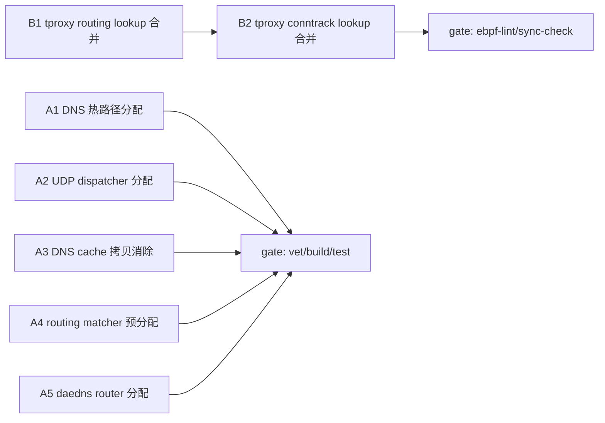

# Sprint 1 Plan — 语义不变的代码精简优化

> 决策依据见 [../brainstorm/brainstorm.md](../brainstorm/brainstorm.md)（D1-D4）。
> 运行时基线见 [runtime-context.md](runtime-context.md)。

## 目标 / Goals

对 dae 现有代码做**等价重构**（不改行为/API），降低运行时开销：
- **方向 A**：Go 内存分配优化（sync.Pool / 预分配 / 消除拷贝）。
- **方向 B**：eBPF C 数据平面精简（tproxy.c 冗余 map lookup 合并）。

## 本 Sprint 不做什么 / Out-of-Scope

- 锁合并 / 重排
- 巨型文件物理拆分（dns_control.go / udp_endpoint_pool.go）
- 测试瘦身 / 批量删测试
- 新增 SemanticRefactorFeature gate 或新协议
- 任何行为 / API / config 语言变更
- 不碰：`vendor/`、`control/kern/headers/vmlinux-*.h`、`control/kern/headers/bpf_helper_defs.h`（生成的）

## Cross-Sprint Drift 检测

**N/A** — 本 Sprint 为项目首个 Sprint，无前序 Sprint 的 runtime-context / lessons-learned / progress「Sprint+1 候选」可读，harness-backlog 为空占位。`verification-fidelity-check.ps1` 无前序 Sprint 可量化，跳过；`drift-check.md` 不生成。

## Evals 回归检查

**N/A** — harness-backlog 无含 `eval` 字段的 Pending 项（首 Sprint）。

---

## Task DAG



### task_dag

```yaml
task_dag:
  properties:
    recommended_topology: hybrid
    topology_rationale: >
      方向 A 任务作用于不同 Go 文件，编辑无冲突，可并行；
      方向 B 任务作用于单一文件 control/kern/tproxy.c，必须串行（B1→B2）；
      A 与 B 语言/文件相互独立，整体 hybrid（A 全并行 + B 内部串行）。
  layers:
    - layer: 1
      parallel: [A1, A2, A3, A4, A5, B1]
    - layer: 2
      serial: [B2]
      depends_on: [B1]
```

### tasks

#### A1 — DNS 热路径分配优化
- **desc**: 审查 DNS 回复/解析热路径的未池化 `make` 分配与可预分配 slice；按 D1 分层策略池化或上栈（响应报文 buffer、dnsmessage packing 临时 slice）。沿用既有 `responseSlotPool`/`dnsResponseBufPool` 规范。
- **target_files**:
  - control/dns.go
  - control/dns_control.go
- **out**: vet/build/test 全过；`allocs/op` 不增。
- **note**: 实现前先确认 `dns_control.go:38` 是否为 `dnsResponseBufPool.New`（避免重复池化）。

#### A2 — UDP dispatcher 分配优化
- **desc**: 审查有序 ingress / 回复 dispatcher 与 batch 的临时 slice/buffer 分配；预分配 batch 容量、跨迭代复用 scratch。沿用 `udpEndpointReplyObjects`/`queueChPool` 规范。
- **target_files**:
  - control/udp_ordered_dispatcher.go
  - control/udp_reply_dispatcher.go
  - control/udp_ingress_batch.go
- **out**: vet/build/test 全过（含 udp dispatcher bench）。

#### A3 — DNS cache 拷贝消除
- **desc**: 审查 `Clone`/`CloneForReload`/`GetPackedResponseWithApproximateTTL`/`prepackResponseBeforeStore` 的拷贝；COW 共享不可变前缀或预分配。`ttlScratchSlice` 已是栈数组模式，保持。
- **target_files**:
  - control/dns_cache.go
- **out**: vet/build/test 全过；dns_cache bench 不回归。

#### A4 — Routing matcher builder 预分配
- **desc**: 构建期 rule 数已知，`make([]T, 0, knownCap)` 预分配 rule/domain trie node slice，消除 append 扩容。
- **target_files**:
  - control/routing_matcher_builder.go
- **out**: vet/build/test 全过；构建期无功能差异。

#### A5 — daedns router 分配优化
- **desc**: per-query 响应 buffer 复用、消除每查询分配；沿用 `component/daedns/client.go:udpDNSBufPool` 模式。
- **target_files**:
  - component/daedns/router.go
- **out**: vet/build/test 全过。

#### B1 — tproxy.c routing 路径 lookup 合并（eBPF）
- **desc**: 按 D2，先用 `clang -O2 -emit-llvm` + verifier log 确认 routing core（`routing_map`/`domain_routing_map`/`active_routing_epoch_map`/`routing_meta_map` 相关）哪些 lookup 真冗余（clang 无法 DCE）；仅合并同函数内、被函数调用阻断分析的真重复。scratch map（per-CPU）不动。
- **target_files**:
  - control/kern/tproxy.c
- **out**: `make ebpf-lint` 零 warning；`make ebpf-sync-check` 通过；verifier instruction count 不增。
- **depends_on**: 无（与 A 并行）。

#### B2 — tproxy.c conntrack 路径 lookup 合并（eBPF）
- **desc**: 按 D2，合并 conntrack/relay 路径中 `conn_state_map`（tproxy.c:1837/1907/1956/2046 等）的真冗余 lookup。需确认合并后 verifier 仍放行、语义不变。
- **target_files**:
  - control/kern/tproxy.c
- **out**: 同 B1；verifier instruction count 不增。
- **depends_on**: B1（同一文件，串行）。

---

## target_rules

```yaml
target_rules:
  languages: [go, c]
  must_pass_english_comments: true   # AGENTS.md 硬规则：代码注释仅英文
  forbidden_paths:
    - vendor/
    - control/kern/headers/vmlinux-*.h
    - control/kern/headers/bpf_helper_defs.h
  forbidden_actions:
    - 新增 SemanticRefactorFeature gate
    - 行为/API/config 语言变更
```

## verifiable_gates

```yaml
verifiable_gates:
  local_gate:        # 所有任务本地必过
    - cmd: go vet ./...
      applies_to: [A1, A2, A3, A4, A5]
    - cmd: go build -tags=$(cat .build_tags) ./...
      applies_to: [A1, A2, A3, A4, A5, B1, B2]
    - cmd: go test ./control/... ./component/...
      applies_to: [A1, A2, A3, A4, A5, B1, B2]
    - cmd: make ebpf-lint
      applies_to: [B1, B2]
      expect: 零 warning
    - cmd: make ebpf-sync-check
      applies_to: [B1, B2]
      expect: Go 绑定与 C 定义一致
    - cmd: go test -race ./control/... ./component/...   # 抽检（按 D1，Pool 改动必跑）
      applies_to: [A1, A2, A3, A5]
  ci_gate:           # 需真实 kernel，本机跳过
    - cmd: make ebpf-test
      applies_to: [B1, B2]
      local: ignored   # WSL2 kernel 6.18 非 CI matrix(6.6/6.12)，依赖 CI
  equivalence_gate:  # 语义等价（D4）
    - framework: control/semantic_refactor_gate.go   # 既有框架，仅参考不改
    - requirement: 无行为/API/config 变更；benchmark allocs/op 与 instruction count 不回归
```

## task_sizing

```yaml
task_sizing:
  task_count: 7            # A1-A5 + B1 + B2
  strong_coupling_count: 1 # B1→B2（同文件串行）
  parallel_groups:
    - [A1, A2, A3, A4, A5] # 方向 A 全并行
  serial_chains:
    - [B1, B2]             # 方向 B 串行
  dag_layers: 2            # L1: A1-A5+B1 并行；L2: B2
```

## blast_radius

```yaml
blast_radius:
  commit_budget: 5         # = ceil(task_count/3) + strong_coupling_count + 1 = ceil(7/3)+1+1 = 3+1+1
  commit_budget_formula: ceil(task_count/3) + strong_coupling_count + 1
  hard_cap: 10
  branch_required: true
  branch: kdae             # 已是 feature branch ✅
  block_force_push: true
  block_destructive_sql: true
```

## 应用 backlog 项

**N/A** — harness-backlog 无 Pending 项（首 Sprint）。
